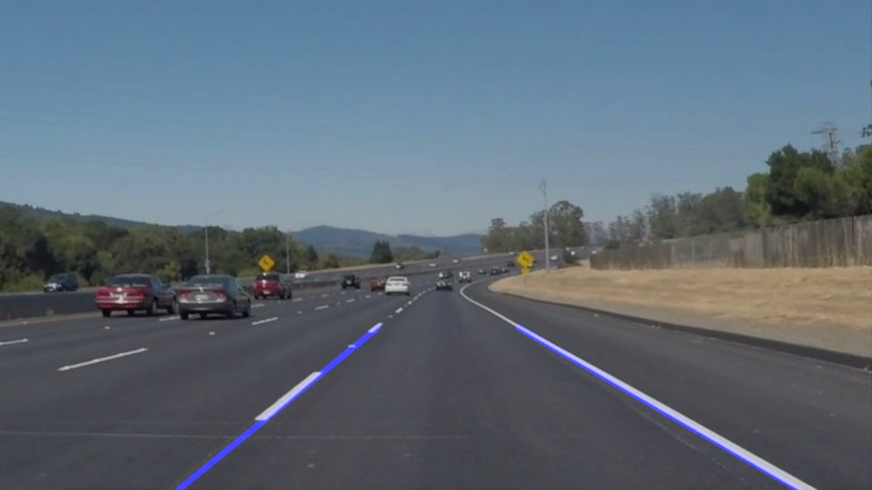

# **Finding Lane Lines on the Road** 

Overview
---

When we drive, we use our eyes to decide where to go.  The lines on the road that show us where the lanes are act as our constant reference for where to steer the vehicle.  Naturally, one of the first things we would like to do in developing a self-driving car is to automatically detect lane lines using an algorithm (copyright belongs to Udacity|CarND).

In this project I use the tools and env include: Jupyter notebook, python3.6 and opencv

**For more tech details, please read through [writeup.md][1] file**
[1]: writeup.md

