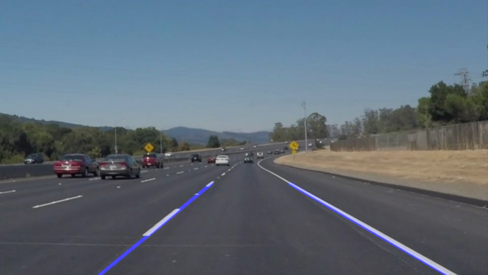

# **Finding Lane Lines on the Road** 

---

**Finding Lane Lines on the Road**

The goals / steps of this project are the following:
 - Make a pipeline that finds lane lines on the road
 - Reflect on your work in a written report

---

## Reflection

### 1. Describe the pipeline. As part of the description, I will explain how I modified the draw_lines() function.

My pipeline consisted of 7 steps: 

* read image from file or video stream
* converted the images to grayscale
* implyment color mask to filter out all colors except white and yellow
* find objects' edge by using Canny
* select region of interest from the image
* implyment hough transfer method to find lines
* find the best line for left and right sides, draw on the original image 

In order to draw a single line on the left and right lanes, I modified the draw_lines() function by:
* define a function called find_best_lines_v2()
* find_best_lines_v2() helps to find the longest line among bench of lines
* the line direction (left or right) defined by line's slop 
	- m = (y1-y2)/(x2-x1)
	- left line, m>0; right line, m<0
* both left line and right line are extended to the edge of region of interest

If you'd like to see what the final result looks like to show how the pipeline works, please see below: 

### 2. Identify potential shortcomings with your current pipeline

One potential shortcoming would be what would happen when there are some texture on the road between the left and right lines, sometimes
my program is confused and cannot find correct line.

Another shortcoming could be when I feed chelleng.mp4 into my program, since the camera has different position and the car head is exposed in the view, the edge of the car head sometimes recognized as a line.

### 3. Suggest possible improvements to your pipeline

A possible improvement would be to adjust the position of my region of interest and move vehicle head out of it.

Also, I think modify the paremeter of gaussian blur function can help to remove the texture on the road.
